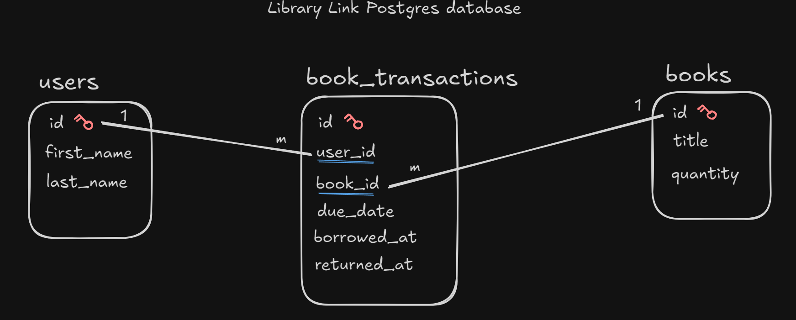

# Library Link
RESTful API built in Go with standard library, executing (raw) SQL queries with Pgx package towards PostgreSQL database.

## Get the app up and running
1. Clone the repository. `git clone <repo-link>`
2. Move into the root dir. `cd library-link`
3. Before running the app set the environment variables in the `.env` file:
  - First copy and rename the `.env.example`.  `cp .env.example .env`
  - Fill in necessary items with you favorite editor. `vim .env`
4. Start the app with docker compose. `docker compose up -d`
5. The app should now be accessible on `localhost:8080` (in case of problems, check the api port number in `.env` file).

## RESTful API endpoints
|Description|Method|Route|Status|
|---|---|---|---|
|Greet user|GET|/|Working|
|Add new user|POST|/users|Working|
|Retrieve all users|GET|/users|Working|
|Retrieve all books|GET|/books|Working|
|Borrow a book (which user which book)|POST|/book-transactions/borrow|Not working (yet)|
|Return a book (which user which book)|POST|/book-transactions/return|Not working (yet)|

## Database schema

